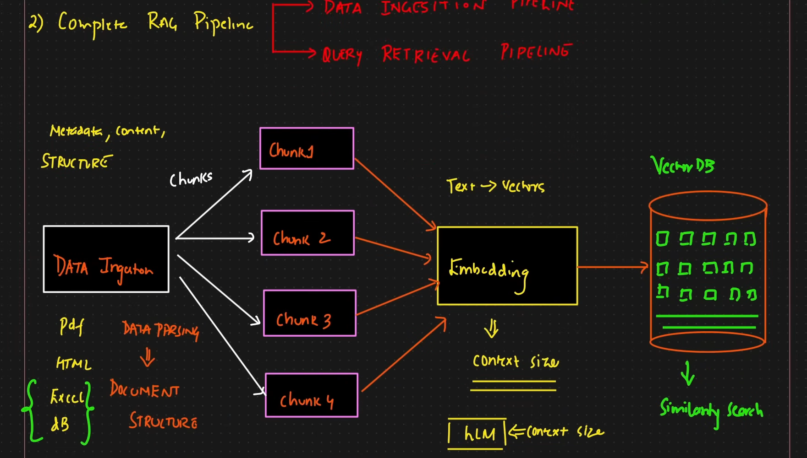
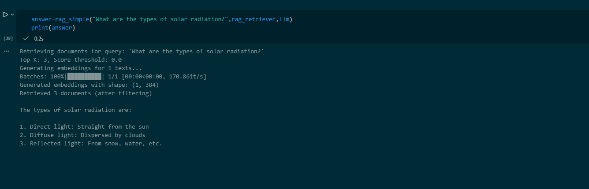

<h2>Python RAG project with langchain and groq LLM</h2>

Pdf documents are embedded in a vector store. Pdfs are chunked before storage. They are used to give context and answer queries using groq LLM.

Example of usage:
 

to run code, use:
py app.py
